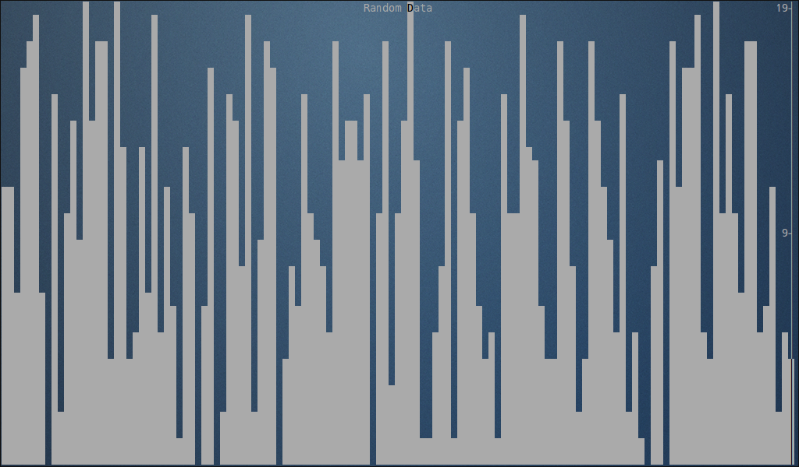

# Fireplace

A no-nonsense command-line graphing utility written in Rust. About as useful as a video of a fireplace.


# Features
- Fixed, linear scaling based on a user-determined lower and upper bound
- Variable, linear scaling (by default) that adjusts to show the visible minimum and maximum values
- Graphs containing negative and positive numbers
- Customizable titles

# Upcoming Features
- Logarithmic scales 

# Prerequesites
To build, you'll need a recent build of Rust and ncurses development files.

# Installation
```
git clone https://github.com/jswrenn/fireplace.git
cd fireplace
cargo build
```

# Usage
To graph with fireplace, all you need is some numbers. By default, fireplace will choose variable scaling.
```
T=0.0
while true;
do
    echo "scale=5;s($T)" | bc -l;
    T=$T+0.1;
    sleep 0.1;
done | ./target/fireplace
```

If you have an input range in mind, fixed scales can be specifies with `--fixed` or `-f``. You must additionally specify an upper bound, and optionally, a lower bound on the graph. If fixed scalign is chosen without a specified lower bound, zero is used instead. Fixed bounds can be used, for example, to limit the above graph to just positive values:
```
T=0.0
while true;
do
    echo "scale=5;s($T)" | bc -l;
    T=$T+0.1;
    sleep 0.1;
done | ./target/fireplace --fixed --lower 0.0 --upper 1.0
```
